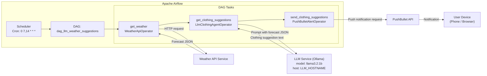

# Architecture – LLM Weather-Based Clothing Suggestions

This document describes the architecture of the **LLM-powered weather-based clothing suggestion system** built using **Apache Airflow**.

The system fetches short-term weather forecasts, reasons over them using a language model agent, and delivers concise clothing recommendations to the user via push notifications.

---

## High-Level Overview

The solution consists of four major layers:

1. **Orchestration Layer (Apache Airflow)**
2. **Data Acquisition Layer (Weather API)**
3. **Decision Intelligence Layer (LLM Agent)**
4. **Notification Layer (PushBullet)**

Each layer is isolated using custom Airflow operators, making the system modular and extensible.

---

## Workflow Summary

- The DAG runs **twice daily (07:00 & 14:00, Europe/London)**.
- Weather data is retrieved for Bromley, UK.
- A constrained LLM agent interprets the forecast and produces clothing advice.
- The final recommendation is delivered directly to the user’s device.

---

## Detailed Workflow

### 1. Workflow Orchestration

- **DAG ID:** `dag_llm_weather_suggestions`
- **Schedule:** `0 7,14 * * *`
- **Timezone:** Europe/London
- **Catchup:** Disabled

The Airflow Scheduler triggers the DAG based on the defined cron schedule.

---

### 2. Weather Retrieval (`get_weather`)

**Operator:** `WeatherApiOperator`

**Responsibility:**

- Queries an external Weather API.
- Retrieves forecast data for the next hour.

**Inputs:**

- Latitude: `51.406`
- Longitude: `0.015`
- Forecast window: `1 hour`

**Outputs:**

- Structured weather forecast JSON (pushed to XCom).

This task performs **no interpretation**, only data collection.

---

### 3. Clothing Recommendation Engine (`get_clothing_suggestions`)

**Operator:** `LlmClothingAgentOperator`  
**Base Class:** `BaseOperator`  
**Template Fields:** `weather_conditions`

This is the **core intelligence** of the system.

#### Internal Design

```text
Airflow Task
 └── LlmClothingAgentOperator
      ├── agno.agent.Agent
      │     └── agno.models.ollama.Ollama
      └── Structured Prompt + Deterministic Rules
```

#### Class Definition Overview

The `LlmClothingAgentOperator` wraps an **LLM agent** that uses the `agno` framework and the `Ollama` model wrapper to talk to a local or remote LLM server.

Key elements:

- Inherits from `BaseOperator`.
- Accepts:
  - `hostname` – URL/host of the LLM server.
  - `model_name` – the LLM identifier (e.g. `llama3.2:1b`).
  - `weather_conditions` – list of weather condition dictionaries (JSON-like forecast data).
- Marks `weather_conditions` as an Airflow `template_fields` so it can receive Jinja-templated XCom values.

```python
from airflow.models import BaseOperator
from agno.agent import Agent
from agno.models.ollama import Ollama

class LlmClothingAgentOperator(BaseOperator):
    """Generate clothing suggestions based on weather conditions via an LLM agent."""
    template_fields = ("weather_conditions",)

    def __init__(self, hostname: str, model_name: str, weather_conditions: list, **kwargs) -> None:
        super().__init__(**kwargs)
        self.hostname = hostname
        self.model_name = model_name
        self.weather_conditions = weather_conditions
```

Inside, it uses a helper method `_get_clothing_suggestions()` to:

1. Instantiate an `Agent` with an `Ollama` model backend.
2. Build a structured prompt with rules and the input forecast JSON.
3. Call `agent.run(prompt)`.
4. Return the LLM content as a string.

The `execute()` method simply calls this helper and returns the final text:

```python
    def _get_clothing_suggestions(self):
        agent = Agent(
            model=Ollama(id=self.model_name, host=self.hostname),
            description="You are a helpful assistant."
        )
        # prompt construction (see below)
        response = agent.run(prompt)
        return str(self.weather_conditions) + response.content

    def execute(self, context):
        llm_response = self._get_clothing_suggestions()
        return llm_response
```

> Note: The returned value currently concatenates `str(self.weather_conditions)` with `response.content`. This can be kept as-is for debugging or adjusted to return only the LLM’s formatted response.

---

## LLM Prompt & Constraints

To reduce hallucinations and ensure predictable output, the LLM is **strongly guided** by the prompt.

### Prompt Structure

The operator builds a multi-part prompt:

1. **Role & Purpose**
   - “You are a clothing suggestion assistant.”
2. **Task**
   - Analyze the forecast JSON and give a short, human-friendly recommendation.
3. **Fixed Reply Style**
4. **Guidelines / Rules**
5. **Input Forecast**
   - Injects the raw JSON list of forecast entries.

### Fixed Output Format

The LLM must always respond in this format:

```text
Summary: <short summary>.
Clothing: <what to wear>.
Umbrella: <yes/no>.
Accessories: <comma-separated list>.
Weather Info: <temperature range>, feels like <range>, wind <range> km/h, rain chance <max rain chance>%.
```

This provides:

- **Consistency** – easy to parse and skim.
- **Suitability for notifications** – short, structured lines.
- **Optional future parsing** – could be turned into structured JSON later.

---

### Decision Rules in the Prompt

The prompt encodes explicit rules for interpreting the weather:

- **Temperature rules (°C):**
  - Cold `< 12` → heavy jacket, layers
  - Cool `12–18` → light jacket or sweater
  - Mild `18–24` → light clothing
  - Hot `> 24` → shorts, breathable clothing
- **Feels-like temperature (`feels_like_c`) is more important than actual.**
- **Rain chance > 40% → Umbrella: yes**
- **Wind > 15 km/h → mention jacket/windbreaker in clothing or accessories.**
- **If temperatures vary throughout the day → suggest layers.**

These constraints act as a **rule-based skeleton** around which the LLM fills in natural language.

---

### 4. Notification Delivery (`send_clothing_suggestions`)

**Operator:** `PushBulletAlertOperator`

**Responsibility:**

- Sends the final clothing recommendation as a PushBullet notification.

**Inputs:**

- `title="Clothing Suggestion"`
- `message="{{ ti.xcom_pull(task_ids='get_clothing_suggestions') }}"`
- `notify_sound="falling"`

**Outputs:**

- A notification on the user’s device with a concise clothing summary.

---

## End-to-End Architecture Diagram



---

## Configuration

### Airflow DAG Configuration

- **Schedule:** `0 7,14 * * *`
- **Timezone:** `Europe/London`
- **Catchup:** `False`
- **Tags:** `["Clothing_Suggestions"]`

### Airflow Variables

| Variable       | Description                         |
| -------------- | ----------------------------------- |
| `LLM_HOSTNAME` | Hostname / base URL of the LLM host |

### External Dependencies

- **Weather API**
  - Provides hourly forecast data; likely requires an API key.
- **Ollama / LLM Host**
  - Hosts the language model (`llama3.2:1b`) used to generate clothing advice.
- **PushBullet**
  - Handles delivery of notifications to devices (phone, browser, etc.).

---

## Design Principles

- **Separation of Concerns**
  - Weather retrieval, decision logic, and notifications are separate operators.
- **Deterministic LLM Behaviour**
  - Strong prompt constraints and fixed reply style.
- **Notification-First Output**
  - Short, readable text designed for mobile notifications.
- **Extensibility**
  - Easy to:
    - Add new locations.
    - Swap the notification channel (e.g. Slack, email).
    - Change the LLM model.
    - Refine the rules in the prompt.

---

## Potential Future Enhancements

- Multi-location support (user/profile-based)
- User-specific style preferences (e.g. “I run hot/cold”)
- Alerting for extreme weather conditions
- Logging and analytics dashboard (e.g. how often umbrella = yes)
- UI-based configuration (Airflow plugin or external dashboard)

---

## Author

**Rahul**  
(Feel free to update this section with your full name, GitHub, or portfolio links.)
